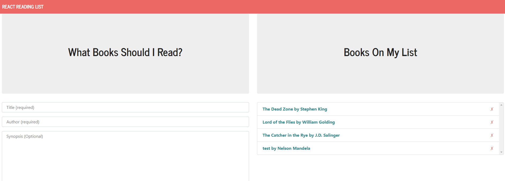
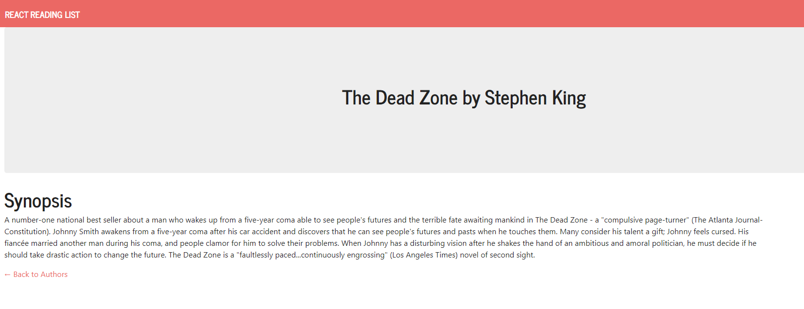

# Book-list-Directory

## Functional description
This app allows the user to post the name, of the book, author and descrption in the to-read list.once posted the user can see their latest books added with the previous books if added any on the right side of the page. when we click on the name of the book on the lists it navigates to the inividual book's page. The app is built in react for the front end and the backend rest api was built using nodejs and express server and mongodb database.

## Technologies used
* React
* Nodejs
* expressjs
* MongoDb
* mongoose data modeler
* bootstrap
* react-router
* axios

## Screenshots

[herokuLink](https://book-react-list.herokuapp.com/)

